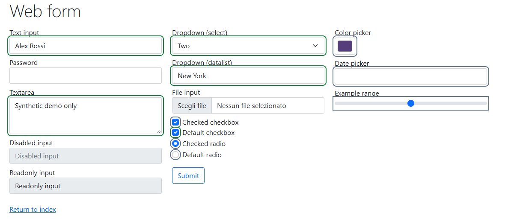
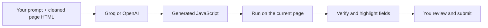

<div align="center">

# AI Form Autocompiler

### Your words. The right fields.

Describe what you want to enter. Let AI fill the page.


[](https://github.com/DavideWasTaken/AI-Form-Autocompiler/actions/workflows/checks.yml)
[](LICENSE)

[Get started](#get-started) · [Features](#features) · [Tested on](#tested-on) · [Privacy](docs/privacy.md)


</div>

A Chrome extension that turns a natural-language prompt into filled web forms. It reads the current page, asks **Groq or OpenAI** to generate JavaScript for it, runs that code on the page and checks every reported field against its real value.

Bring your own API key. No backend, no account, no build step.

## One prompt instead of field by field

> My name is Alex Rossi. My email is alex@example.test. I live in Milan and I'm looking for a three-room apartment up to €350,000. Prefer email contact. Keep the existing reference unchanged.

Click **Fill this page**, check the highlighted fields, then submit the form yourself.



_Selenium's public demo form filled with live Groq. Green = verified, grey = left unchanged._

## Features

| Feature                 | What it does                                                                                                     |
| ----------------------- | ---------------------------------------------------------------------------------------------------------------- |
| Understands the page    | Uses labels, nearby text and current values to map your instructions to the right fields.                        |
| All common controls     | Text, email, dates, selects, multiple selects, checkboxes, radios, datalists, editable text and ARIA widgets.     |
| Works with React        | Uses native setters and input/change events so controlled inputs update application state.                      |
| Verified results        | Every reported value is compared with the live field. The page shows green (verified), red (failed), grey (skipped). |
| Undo last fill          | Restores the previous values of the fields it changed. Anything you edited afterwards is kept.                  |
| Fill only what you need | Choose all fields, **empty fields only**, or **retry failed fields** without touching the ones already correct. |
| Keeps existing answers  | Filled fields stay as they are unless your prompt asks to replace them.                                          |
| Guided setup            | A checklist shows what is ready (user scripts, API key, site access) and **Test connection** checks key and model. |
| Groq or OpenAI          | Pick the provider and model in the popup. Groq is the default.                                                   |

## Get started

1. **Download** this repository with **Code → Download ZIP** and extract it, or clone it.
2. In **Chrome 138+**, open `chrome://extensions` and enable **Developer mode**.
3. Click **Load unpacked** and select the project's **`src` folder**.
4. Open the popup. If the checklist says so, click **Open extension settings** and enable **Allow User Scripts** ([Chrome requirement](https://developer.chrome.com/docs/extensions/reference/api/userScripts#enable_usage_of_the_userscripts_api) for running generated code), then reopen the popup.
5. Choose **Groq** or **OpenAI**, paste your API key, click **Save**, then **Test connection**.
6. Open a page with a form, describe what to fill and click **Fill this page**. Allow access to the site when Chrome asks.

No Node.js or terminal needed to use it. Keys live in browser session storage, so you enter them again after restarting Chrome.

| Provider   | Default model         | Get an API key                                          |
| ---------- | --------------------- | ------------------------------------------------------- |
| **Groq**   | `openai/gpt-oss-120b` | [Groq Console](https://console.groq.com/keys)           |
| **OpenAI** | `gpt-4.1-mini`        | [OpenAI Platform](https://platform.openai.com/api-keys) |

The model field is editable, so you can use any chat model your account has access to.

## Tested on

Live runs with Groq (`openai/gpt-oss-120b`), synthetic data, submissions blocked:

| Page                                                                         | Result                                  |
| ---------------------------------------------------------------------------- | --------------------------------------- |
| [Selenium web form](https://www.selenium.dev/selenium/web/web-form.html)     | Passed · 5 fields verified · undo verified |
| [Selenium form page](https://www.selenium.dev/selenium/web/formPage.html)    | Passed · 4 fields verified · undo verified |
| [Playwright TodoMVC](https://demo.playwright.dev/todomvc/) (React-style app) | Passed · 1 field verified · undo verified |
| Native controls, preserving an existing answer                               | Passed                                  |
| React controlled inputs and rendered state                                   | Passed                                  |
| Duplicate labels, editable text and multiple selection                       | Passed                                  |
| Custom ARIA controls and an open shadow root                                 | Passed                                  |
| Page text trying to override the user's instructions                         | Passed                                  |

AI generation took **1–4 seconds** per page. The repository also runs **81 unit tests** and **25 Chromium integration checks** on every push. Details in the [test report](docs/testing.md).

## How it works



The extension captures visible page context, labels and current values, with scripts, styles, passwords, hidden, file and payment fields removed. The model returns code that fills the fields plus a report of what it set; a separate check compares that report with the live page.

The generated code runs right after you click Fill. It is instructed never to submit, navigate or send data: you review the page and submit the form yourself.

## Your data

- Your prompt and the cleaned page go **directly to the provider you choose**. There is no project server or analytics.
- API keys stay in Chrome session storage, readable only by the extension. They are never sent to the page or included in the prompt.
- Page content is never written to disk. The last result summary stays in session storage until the tab closes, and the undo checkpoint lives only in the page's memory.

Full details in [privacy and execution notes](docs/privacy.md).

## Development

Requires **Node.js 22+**:

```sh
npm ci
npx playwright install chromium
npm test
npm run test:browser
npm run demo   # synthetic forms at http://127.0.0.1:8841
```

Live checks call the provider and may be billed:

```sh
# With GROQ_API_KEY (or OPENAI_API_KEY) set locally
npm run test:live -- --provider=groq
node tests/external.mjs --provider=groq --undo
```

See [testing instructions](docs/testing.md) for pacing, single cases and artifacts.

## Troubleshooting

| Message or symptom            | What to do                                                                         |
| ----------------------------- | ---------------------------------------------------------------------------------- |
| Enable Allow User Scripts     | Click **Open extension settings**, turn it on, then reopen the popup.              |
| Site access required          | Allow access when you click Fill on the page.                                      |
| Authentication failed         | Save a valid API key for the selected provider, then **Test connection**.          |
| Rate limit or quota reached   | Check the provider's limits, credit and billing.                                   |
| Page changed while generating | Review the current page, then start a new fill.                                    |
| Some fields failed            | Choose **Retry failed fields**, or name the field and the correct value in the prompt. |
| Result not what you wanted    | Click **Undo last fill**, adjust the prompt and fill again.                        |
| Page too large                | Open the form on its own page or with less surrounding content.                    |

## License

[MIT](LICENSE) · Built by [DavideWasTaken](https://github.com/DavideWasTaken)
