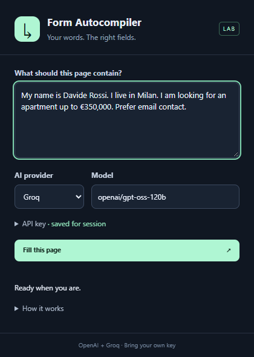
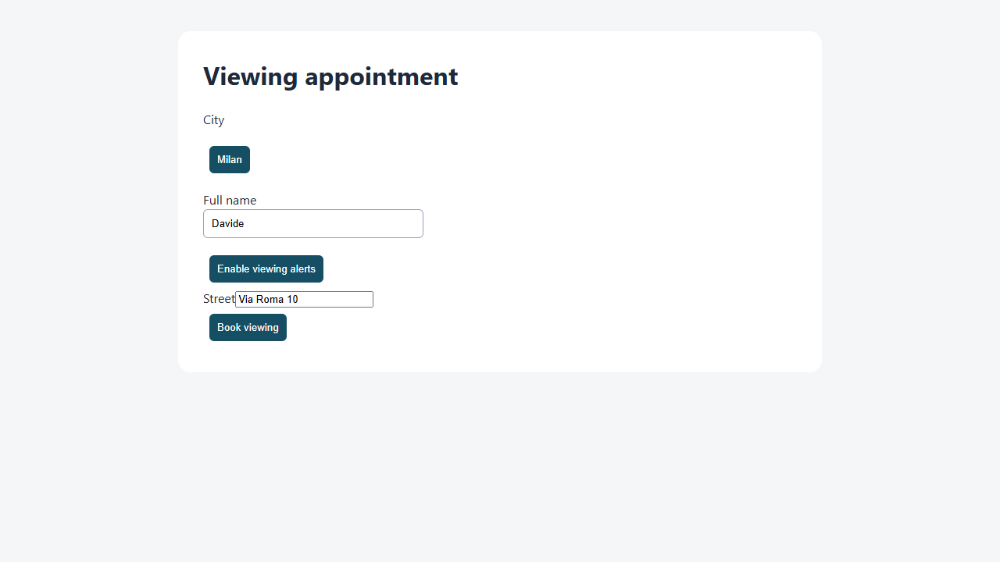

# AI Form Autocompiler

**Describe what belongs on the page. Let AI fill the fields.**

A small Chrome extension that sends the current page’s cleaned HTML and your instructions to OpenAI or Groq. The model writes JavaScript, which runs immediately on that page. You review the populated fields and submit manually.

**Experimental local candidate. Publication is on hold until successful live AI testing.** Browser integration has been tested with mocked responses. The current OpenAI trials were blocked by exhausted API credit; they do not establish filling accuracy or generation speed. See [testing](docs/testing.md).



## Start in five minutes

1. Use **Chrome 138 or newer**. Download or copy this project to a local folder.
2. Open `chrome://extensions` and enable **Developer mode**.
3. Choose **Load unpacked**, then select this project’s **`src` folder**.
4. Open the extension’s **Details** and enable **Allow User Scripts**. Reopen the popup afterward. Chrome documents this separate switch in its [userScripts setup guide](https://developer.chrome.com/docs/extensions/reference/api/userScripts#enable_usage_of_the_userscripts_api).
5. Open a regular web page with a form. In the extension, choose a provider, enter your API key, and click **Save**.

There is no build step or Node.js requirement for loading the extension. An API account with access to the selected model is required; usage may incur provider charges.

| Provider                 | Default model         | API documentation                                                                     |
| ------------------------ | --------------------- | ------------------------------------------------------------------------------------- |
| Groq, initially selected | `openai/gpt-oss-120b` | [Groq OpenAI compatibility](https://console.groq.com/docs/openai)                     |
| OpenAI                   | `gpt-4.1-mini`        | [OpenAI Chat Completions](https://developers.openai.com/api/reference/resources/chat) |

The model field is editable. API keys are kept in Chrome session storage, with access restricted to trusted extension contexts. Use **Forget** to remove the selected provider’s key. Provider and model preferences are saved locally.

## Fill a page

Write the facts you want entered, including which existing answers should change. For example:

> My full name is Alex Rossi. My email is alex@example.test. I live in Milan and I’m looking for a three-room apartment up to €350,000. Prefer email contact. Keep the existing reference unchanged.

Click **Fill this page** and allow site access when Chrome asks. Keep the page open while generation runs. The result shows how many reported values were verified, how many changed, and which entries failed or were skipped. Review the whole form before submitting it yourself.



**There is no mandatory preview.** Clicking Fill authorizes generated JavaScript to run after the provider responds. **Cancel generation** can stop the request before execution starts; it cannot stop a script already running. An error can leave some fields changed, and there is no automatic rollback.

## What happens when you click Fill

1. Capture the top-level page’s cleaned HTML, current field values, labels, title and URL without query or fragment.
2. Send that snapshot and your prompt directly to the chosen provider.
3. Execute the generated JavaScript in Chrome’s `USER_SCRIPT` world on the captured document.
4. Independently read the reported fields and compare their values and native validity with the script’s report.

The model is instructed to preserve existing answers, avoid invented information, ignore instructions embedded in the page, and never submit or navigate. These are generation rules. Arbitrary generated code can still perform unintended actions through the page DOM; the execution environment does not guarantee compliance. User-script extension messaging is disabled, and the script receives no extension API key.

## Scope and limits

- Native inputs, textareas, selects, checkboxes and radios have a DOM helper that dispatches events. Clearing an already selected radio is unsupported; select another option in its group. The model can also use DOM interactions for custom widgets.
- Open shadow roots are captured; closed shadow roots and embedded iframe forms are unsupported.
- Complex widgets and dynamic pages are best effort. The script can make mistakes even when reported values match the DOM.
- Changed field values or navigation during generation stop execution when detected. This does not detect every possible page change.
- Password, hidden and file inputs, plus fields identified by credit-card or one-time-code autocomplete tokens, are excluded from capture. This is not comprehensive sensitive-data detection.
- Capture is limited to 100,000 HTML characters, the combined messages to 120,000 characters, your prompt to 6,000 characters, and generated code to 30,000 characters. Oversized pages fail instead of being silently truncated.
- Provider requests time out after 25 seconds and are not retried automatically. Execution that has not returned after 15 seconds is reported as uncertain and blocks another fill until the page is refreshed. This does not forcibly stop arbitrary JavaScript; a synchronous infinite loop can freeze the page.

This is a personal experimental tool. Start with synthetic or low-stakes forms, inspect the results, and decide which page content you are comfortable sending to a provider. Read the [privacy and execution notes](docs/privacy.md) before using private pages.

## Try the local form lab

Development and tests use Node.js 22 or newer:

```sh
npm ci
npx playwright install chromium
npm run demo
```

Open the printed address, normally `http://127.0.0.1:8841`. The lab includes native fields, React controls, duplicate labels, custom ARIA widgets, open shadow DOM, and an instruction-injection fixture. It uses synthetic data and prevents fixture form submissions.

```sh
npm test
npm run test:browser
```

Live OpenAI testing is available through `npm run test:live` after setting `OPENAI_API_KEY` locally. It makes real, potentially billable API requests. Full instructions and the current evidence are in [docs/testing.md](docs/testing.md).

## Troubleshooting

| Message or symptom            | Next step                                                                                                                   |
| ----------------------------- | --------------------------------------------------------------------------------------------------------------------------- |
| Enable Allow User Scripts     | Enable the switch in extension Details, then reopen the popup. Reload the extension if Chrome still reports it unavailable. |
| Site access required          | Grant access to the page’s site when you click Fill.                                                                        |
| Authentication failed         | Save a valid key for the selected provider.                                                                                 |
| Rate limit or quota reached   | Check API billing, remaining credit and rate limits with that provider.                                                     |
| Page changed while generating | Check existing values, then start again on the current page.                                                                |
| No fields verified            | Read skipped/failed entries and inspect the page before retrying. An iframe or custom control may be unsupported.           |
| Page too large                | Open a smaller page or dedicated form section.                                                                              |

## License

[MIT](LICENSE) · DavideWasTaken
