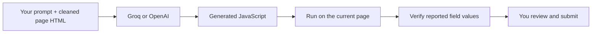

<div align="center">

# AI Form Autocompiler

### Your words. The right fields.

Describe what you want to enter. Let AI fill the page.


[](https://github.com/DavideWasTaken/AI-Form-Autocompiler/actions/workflows/checks.yml)
[](LICENSE)

[Get started](#get-started) · [How it works](#how-it-works) · [Test results](#does-it-work) · [Privacy](docs/privacy.md)


</div>

An experimental Chrome extension that turns a natural-language prompt into filled web forms. It reads the current page's cleaned HTML, asks **Groq or OpenAI** to generate JavaScript, runs it on the page, and checks the reported fields against their actual values.

Bring your own API key. No project backend, account registration, or build step.

## A prompt instead of a field-by-field routine

> My name is Alex Rossi. My email is alex@example.test. I live in Milan and I'm looking for a three-room apartment up to €350,000. Prefer email contact. Keep the existing reference unchanged.

Click **Fill this page**, inspect the result, then submit the form yourself.

| Feature               | What it does                                                                                             |
| --------------------- | -------------------------------------------------------------------------------------------------------- |
| Context from the page | Uses labels, nearby text and current values to map your instructions to fields.                          |
| More than text inputs | Handles native selects, dates, checkboxes and radios; also attempts custom widgets and editable content. |
| Groq or OpenAI        | Choose a provider and model in the popup. Groq is selected by default.                                   |
| React-aware updates   | Provides native setters and input/change events to help controlled inputs update application state.      |
| Result verification   | Compares reported changes with the live fields and surfaces failed or skipped entries.                   |
| Existing answers      | Instructs the model to preserve filled fields unless you ask to replace them.                            |

Designed for general web forms. Compatibility depends on the page; embedded iframe forms and closed shadow roots are currently unsupported.

## Get started

1. **Download** this repository with **Code → Download ZIP** and extract it, or clone it.
2. In **Chrome 138+**, open `chrome://extensions` and enable **Developer mode**.
3. Click **Load unpacked** and select the extracted project's **`src` folder**.
4. Open the extension's **Details** and enable **Allow User Scripts**, then reopen the popup. This is a [Chrome requirement](https://developer.chrome.com/docs/extensions/reference/api/userScripts#enable_usage_of_the_userscripts_api) for running generated scripts.
5. Open a page with a form. Click the extension, choose **Groq** or **OpenAI**, enter your API key and click **Save**.
6. Describe what to fill, click **Fill this page**, and allow access to that site when Chrome asks.

**That's it.** Loading the extension does not require Node.js or a terminal. API usage depends on your provider's access, rate limits and billing. Keys are kept in browser session storage, so you will need to enter them again after a browser restart.

| Provider   | Default model         | Get an API key                                          |
| ---------- | --------------------- | ------------------------------------------------------- |
| **Groq**   | `openai/gpt-oss-120b` | [Groq Console](https://console.groq.com/keys)           |
| **OpenAI** | `gpt-4.1-mini`        | [OpenAI Platform](https://platform.openai.com/api-keys) |

The model field is editable. Model access and availability depend on your provider account.

## Does it work?

**Yes, on the tested forms.** The latest live Groq run passed **all five scenarios**, with generation taking **1.5–3.8 seconds** (median **2.5 seconds**). These are synthetic test pages using real API calls; timings exclude page capture and script execution.

| Latest live scenario                                     | Result |
| -------------------------------------------------------- | ------ |
| Native controls, including preserving an existing answer | Passed |
| React controlled inputs and rendered state               | Passed |
| Duplicate labels, editable text and multiple selection   | Passed |
| Custom ARIA controls and an open shadow root             | Passed |
| Page text attempting to override the user's instructions | Passed |


_An actual result from the live Groq custom-widget test. All displayed data is synthetic._

There are also **56 unit/package tests** and **19 Chromium integration checks**. Earlier live trials exposed report-format and address-punctuation problems; the refinements and complete outcomes are documented in the [test report](docs/testing.md). The final five-case run is one trial per scenario, not a guarantee for every website.

**Still unverified:** the full native Chrome toolbar/site-permission approval flow and broad compatibility with third-party websites. OpenAI integration passes mocked tests; live OpenAI generation could not be benchmarked because the test account had exhausted its credit.

## How it works



The snapshot includes visible page context, field labels and current values. Capture removes scripts, styles and selected sensitive inputs. The model can use DOM interactions and a small field helper to fill controls. A separate check verifies its report against the live page.

**Generated JavaScript runs immediately after your Fill click.** There is no mandatory preview. The model is instructed not to submit or navigate, but these instructions are not a runtime guarantee. Review the whole form before submitting it yourself.

## Data and practical limits

- **Direct provider calls:** your prompt and cleaned page snapshot go to the provider you choose. There is no project-operated intermediary or analytics service.
- **Session-only keys:** API keys stay in Chrome session storage, restricted to trusted extension contexts. They are not included in the model prompt or passed to the generated script.
- **Page content can be private:** filtering excludes password, hidden and file inputs, plus fields identified by payment or one-time-code autocomplete tokens. Ordinary text and other field values can still contain sensitive information.
- **Best-effort compatibility:** complex widgets and dynamic pages may require corrections. Only the top-level page and open shadow roots are captured.
- **Bounded requests:** oversized pages fail visibly; provider requests time out after 25 seconds without automatic retries.
- **No rollback:** Cancel stops generation before execution starts. It cannot undo edits or stop a running script. An execution timeout blocks another fill until reload, but cannot forcibly terminate arbitrary JavaScript.

See [privacy and execution notes](docs/privacy.md) for the exact data flow, storage and verification boundaries. This is an experimental tool: use it on pages whose data and possible edits you understand.

## Run the form lab

For development and tests, use **Node.js 22+**:

```sh
npm ci
npx playwright install chromium
npm run demo
```

Open `http://127.0.0.1:8841` and try the extension on the included synthetic forms. The fixtures prevent submissions.

```sh
npm test
npm run test:browser

# With GROQ_API_KEY set in your local environment:
npm run test:live -- --provider=groq

# With OPENAI_API_KEY set in your local environment:
npm run test:live
```

Live tests call the selected provider and may incur charges. See [testing instructions](docs/testing.md) for pacing, targeted scenarios and artifacts.

## Troubleshooting

| Message or symptom            | What to do                                                                                    |
| ----------------------------- | --------------------------------------------------------------------------------------------- |
| Enable Allow User Scripts     | Turn it on in extension Details, then reopen the popup. Reload the extension if needed.       |
| Site access required          | Allow access when you click Fill on the page.                                                 |
| Authentication failed         | Save a valid API key for the selected provider.                                               |
| Rate limit or quota reached   | Check the provider's limits, credit and billing.                                              |
| Page changed while generating | Review the current page, then start a new fill.                                               |
| No fields verified            | Inspect the skipped/failed entries; embedded frames and some custom controls are unsupported. |
| Page too large                | Try a smaller page or a dedicated form.                                                       |

## License

[MIT](LICENSE) · Built by [DavideWasTaken](https://github.com/DavideWasTaken)
